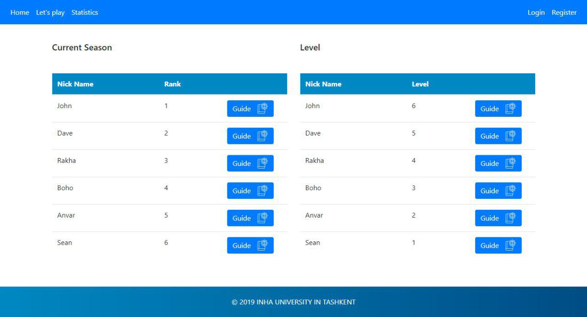

# Power-Sustaining-System-For-Buildings

> online application that provides the service with nice looking and user-friendly interface which will be available on each user’s computer with internet connection

## Team

#### Leader: ####

> Kamronbek Juraev

#### Members: ####

> Murodjon Sadullaev
>
> Rakhmatjon Khasanov


## Setup

### Unix / Linux / Mac Setup

* `apt-get update`

* `apt-get install php5.6 php5.6-mcrypt`

* `git clone https://github.com/KhasanovR/Power-Sustaining-System-For-Buildings.git`

* `cd Power-Sustaining-System-For-Buildings`

* `[sudo] chmod -R 755 app/storage`

* `composer install`

 * `php artisan migrate`

* `php artisan serve`

### Windows Setup

**PHP Setup**

* Open git shell;

* `cd C:/path/to/xampp/htdocs`;

* `git clone https://github.com/KhasanovR/Power-Sustaining-System-For-Buildings.git`;

* `cd Power-Sustaining-System-For-Buildings`;

* `composer update`;

* `C:/path/to/xampp5.6.33/php/php.exe artisan clear-compiled`
 * `C:/path/to/xampp5.6.33/php/php.exe artisan cache:clear`

* Create a table for the app via phpmyadmin (or however you prefer);

* `php artisan migrate`


 **OR IF YOUR PHP IS NOT `mcrypt` COMPATIBLE:**

 `C:/path/to/xampp5.6.33/php/php.exe artisan migrate`

* `php artisan serve`

 **OR IF YOUR PHP IS NOT `mcrypt` COMPATIBLE:**

 `C:/path/to/xampp5.6.33/php/php.exe artisan serve`


## Outline

* Introduction
  * Purpose
  * Product Scope and Functionality
  * Product Prospective
* Specific Requirements
  * Logical Database Requirements
    * Entities type definition table
    * Relationships type definition table
  * Functional Requirements
    * Formulas
* Conceptual Model for Database Design 
  * EE-R Diagram 
* Logical and Physical Database Design (Erwin)
  * ER-Win: Logical Diagram 
  * ER-Win: Physical Diagram 
  * Forward Engineering by ER-WIN
* Relation Schema List – Validation by Normal Form 
* User Interface / Application 
* SQL Queries (samples)

## Introduction

* Purpose:
  * to manage/minimize the power usage and to adapt to different seasons
  * to find golden balance between money and energy usage in buildings.
* Product Scope and Functionality
  * Customize the building with household items using fixed amount of money provided to purchase from the market where household items possessed by the building can be sold
  * Keep track of one’s records, ranks, levels
  * Be guided by other player 
* Product Prospective
  * online application that provides the service with nice looking and user-friendly interface which will be available on each user’s computer with internet connection
  * no software and hardware requirements

## Specific Requirements

### Logical Database Requirements

#### Entities type definition table ####


#### Relationships type definition table ####


### Functional Requirements

* Authentication (Sign up, sign in)
* Visualize Building (UI- Future improvements)
* Visualize Records list of Player
* Visualize Rank list
* Visualize Level list
* Inserting/Updating/Deleting items in Household Market
* Insert/Update/Delete Building parameters seasonally
* Auto evaluate Record, Rank, Level using predefined formulas
* Guide other players to earn level

#### Formulas 

`EE` – Economed Energy
`DE` – Total energy usage of household items in the building
`CE` – Total energy usage of new household items
`GE` – Total energy generated by new energy generating household items

` EE` `=` `DE` `-` `(` `CE` `-` `GE` `)`

`YoR` – Year of Return
`TS` – Total money spent
`DP` – Price of the default items which are going to be sold
`PkW` – Price per kilowatt 

`YoR` `=` `(` `TS` `-` `DP` `/` `2` `)` `/` `(` `EE` `*` `PkW` `)`

## Conceptual Model for Database Design 

Rectangle – Strong Entity Set
Double rectangle – Weak Entity Set
Diamond – Strong Relationship Set
Double Diamond – Identifying Relationship Set
Oval - Normal Attribute
Double Oval – Multivalued Attribute
Chain of Ovals – Composite Attribute
Underline – Primary key
Dashed Underline – Discriminator 
  -Disjoint 
Single Relationship Set with Multiple Entity Sets in a Box – Aggregation 

### EE-R Diagram 

 

### Logical and Physical Database Design (Erwin)

 

### ER-Win: Logical Diagram 


### ER-Win: Physical Diagram 


### Forward Engineering by ER-WIN

```sql
CREATE TABLE Building(
	Season               INTEGER NOT NULL,
	Money_Pack           INTEGER NULL,
	Price_for_KW         INTEGER NULL,
	ID                   INTEGER NOT NULL);
ALTER TABLE Building
ADD CONSTRAINT XPKBuilding PRIMARY KEY (Season);

CREATE TABLE Calculated(
	Season               INTEGER NOT NULL,
	ECG_ID               INTEGER NOT NULL,
	Record_ID            INTEGER NOT NULL,
	Player_ID            INTEGER NOT NULL);
ALTER TABLE Calculated
ADD CONSTRAINT XPKCalculated PRIMARY KEY (Season,ECG_ID,Record_ID,Player_ID);

CREATE TABLE Content_manager(
	ID                   INTEGER NOT NULL);
ALTER TABLE Content_manager
ADD CONSTRAINT XPKContent_manager PRIMARY KEY (ID);

CREATE TABLE Energy_C_G_Items(
	ECG_ID               INTEGER NOT NULL,
	Price                INTEGER NULL,
	Energy_C_G           INTEGER NULL,
	Item_type            CHAR(18) NULL,
	Energy_type          CHAR(18) NULL,
	ID                   INTEGER NOT NULL,
	Min                  INTEGER NULL,
	Max                  INTEGER NULL);
ALTER TABLE Energy_C_G_Items
ADD CONSTRAINT XPKEnergy_C_G_Items PRIMARY KEY (ECG_ID);
CREATE TABLE Guide(
	ECG_ID               INTEGER NOT NULL,
	Season               INTEGER NOT NULL,
	Level_ID             INTEGER NOT NULL,
	Guider               INTEGER NOT NULL,
	Guidee               INTEGER NOT NULL);
ALTER TABLE Guide
ADD CONSTRAINT XPKGuide PRIMARY KEY (ECG_ID,Season,Level_ID,Guider,Guidee);

CREATE TABLE Is_on(
	Level_ID             INTEGER NOT NULL,
	Rank_ID              INTEGER NOT NULL,
	Player_id            INTEGER NOT NULL);
ALTER TABLE Is_on
ADD CONSTRAINT XPKIs_on PRIMARY KEY (Level_ID,Rank_ID,Player_id);

CREATE TABLE Level(
	Level_ID             INTEGER NOT NULL,
	Level_No             INTEGER NULL,
	Guide_Bonus          INTEGER NULL);
ALTER TABLE Level
ADD CONSTRAINT XPKLevel PRIMARY KEY (Level_ID);

CREATE TABLE Phones(
	Phone                CHAR(18) NOT NULL,
	ID                   INTEGER NOT NULL);
ALTER TABLE Phones
ADD CONSTRAINT XPKPhones PRIMARY KEY (Phone,ID);
CREATE TABLE Player(
	ID                   INTEGER NOT NULL);
ALTER TABLE Player
ADD CONSTRAINT XPKPlayer PRIMARY KEY (ID);

CREATE TABLE Possess(
	ECG_ID               INTEGER NOT NULL,
	Season               INTEGER NOT NULL);
ALTER TABLE Possess
ADD CONSTRAINT XPKEnergy_C_G_Items_Building PRIMARY KEY (ECG_ID,Season);

CREATE TABLE Rank(
	Rank_ID              INTEGER NOT NULL,
	Best_of_Record       INTEGER NULL,
	Rank_No              INTEGER NULL);
ALTER TABLE Rank
ADD CONSTRAINT XPKRank PRIMARY KEY (Rank_ID);

CREATE TABLE Ranks_on(
	Rank_ID              INTEGER NOT NULL,
	Record_ID            INTEGER NOT NULL,
	Player_ID            INTEGER NOT NULL);
ALTER TABLE Ranks_on
ADD CONSTRAINT XPKRanks_on PRIMARY KEY (Rank_ID,Record_ID,Player_ID);

CREATE TABLE Records(
	Record_ID            INTEGER NOT NULL,
	Economed_Energy      INTEGER NULL,
	Year_of_Return       INTEGER NULL,
	Left_money           INTEGER NULL,
	Player_ID            INTEGER NOT NULL);
ALTER TABLE Records
ADD CONSTRAINT XPKRecords PRIMARY KEY (Record_ID,Player_ID);

CREATE TABLE Select(
	Season               INTEGER NOT NULL,
	ECG_ID               INTEGER NOT NULL,
	Player_id            INTEGER NOT NULL);
ALTER TABLE Select
ADD CONSTRAINT XPKSelect PRIMARY KEY (Season,ECG_ID,Player_id);

CREATE TABLE User(
	ID                   INTEGER NOT NULL,
	Fname                CHAR(18) NULL,
	Mname                CHAR(18) NULL,
	Lname                CHAR(18) NULL,
	Nickname             CHAR(18) NULL,
	Type                 CHAR(18) NULL,
	password             CHAR(18) NULL,
	Email                CHAR(18) NULL);
ALTER TABLE User
ADD CONSTRAINT XPKUser PRIMARY KEY (ID);

ALTER TABLE Building ADD CONSTRAINT Seasonal_update FOREIGN KEY (ID) REFERENCES Content_manager (ID);
ALTER TABLE Calculated ADD CONSTRAINT Building_to_Calculated FOREIGN KEY (Season) REFERENCES Building (Season);
ALTER TABLE Calculated ADD CONSTRAINT Records_to_Calculated FOREIGN KEY (Record_ID, Player_ID) REFERENCES Records (Record_ID, Player_ID);
ALTER TABLE Calculated ADD CONSTRAINT ECG_to_Calculated FOREIGN KEY (ECG_ID) REFERENCES Energy_C_G_Items (ECG_ID);
ALTER TABLE Content_manager ADD CONSTRAINT specifies_content_manager FOREIGN KEY (ID) REFERENCES User (ID) ON DELETE CASCADE;
ALTER TABLE Energy_C_G_Items ADD CONSTRAINT Insert FOREIGN KEY (ID) REFERENCES Content_manager (ID);
ALTER TABLE Guide ADD CONSTRAINT ECG_to_Guide FOREIGN KEY (ECG_ID) REFERENCES Energy_C_G_Items (ECG_ID);
ALTER TABLE Guide ADD CONSTRAINT Building_to_Guide FOREIGN KEY (Season) REFERENCES Building (Season);
ALTER TABLE Guide ADD CONSTRAINT Level_to_Guide FOREIGN KEY (Level_ID) REFERENCES Level (Level_ID);
ALTER TABLE Guide ADD CONSTRAINT Guider_to_Guide FOREIGN KEY (Guider) REFERENCES Player (ID);
ALTER TABLE Guide ADD CONSTRAINT Guidee_to_Guide FOREIGN KEY (Guidee) REFERENCES Player (ID);
ALTER TABLE Is_on ADD CONSTRAINT Level_to_Is_on FOREIGN KEY (Level_ID) REFERENCES Level (Level_ID);
ALTER TABLE Is_on ADD CONSTRAINT Rank_to_Is_on FOREIGN KEY (Rank_ID) REFERENCES Rank (Rank_ID);
ALTER TABLE Is_on ADD CONSTRAINT Player_to_Is_on FOREIGN KEY (Player_id) REFERENCES Player (ID);
ALTER TABLE Phones ADD CONSTRAINT User_to_Phones FOREIGN KEY (ID) REFERENCES User (ID);
ALTER TABLE Player ADD CONSTRAINT specifies_player FOREIGN KEY (ID) REFERENCES User (ID) ON DELETE CASCADE;
ALTER TABLE Possess ADD CONSTRAINT ECG_Item_to_Possoss FOREIGN KEY (ECG_ID) REFERENCES Energy_C_G_Items (ECG_ID);
ALTER TABLE Possess ADD CONSTRAINT Building_to_Possess FOREIGN KEY (Season) REFERENCES Building (Season);
ALTER TABLE Rank ADD CONSTRAINT has_Best FOREIGN KEY (Best_of_Record) REFERENCES Rank (Rank_ID);
ALTER TABLE Ranks_on ADD CONSTRAINT Rank_to_Ranks_on FOREIGN KEY (Rank_ID) REFERENCES Rank (Rank_ID);
ALTER TABLE Ranks_on ADD CONSTRAINT Records_to_Ranks_on FOREIGN KEY (Record_ID, Player_ID) REFERENCES Records (Record_ID, Player_ID);
ALTER TABLE Ranks_on ADD CONSTRAINT Player_to_Ranks_on FOREIGN KEY (Player_ID) REFERENCES Player (ID);
ALTER TABLE Records ADD CONSTRAINT Has FOREIGN KEY (Player_ID) REFERENCES Player (ID);
ALTER TABLE Select ADD CONSTRAINT Building_to_Select FOREIGN KEY (Season) REFERENCES Building (Season);
ALTER TABLE Select ADD CONSTRAINT ECG_to_Select FOREIGN KEY (ECG_ID) REFERENCES Energy_C_G_Items (ECG_ID);
ALTER TABLE Select ADD CONSTRAINT Player_to_Select FOREIGN KEY (Player_id) REFERENCES Player (ID);
```

## Relation Schema List – Validation by Normal Form 


## User Interface / Application 





## SQL Queries (samples)

```sql
INSERT INTO `users` (`id`, `Fname`, `Mname`, `Lname`, `Nickname`, `avatar`, `email`, `type`, `email_verified_at`, `password`, `remember_token`, `created_at`, `updated_at`) VALUES (1, 'Delbert', 'M', 'Kozey', 'brandi.altenwerth', 'avatar.png', 'qhauck@ullrich.com', 'pl', NULL, '$2y$10$NPAUHHO43tMnRKrMCOCZ..h6lhNgxpZwk43IPlCk7jT.HlV4S.iDm', NULL, '2019-04-28 18:11:38', '2019-04-28 18:11:38'),
```

```
(2, 'Ashlee', 'M', 'Harvey', 'harmon08', 'avatar.png', 'milo.ankunding@bogisich.net', 'pl', NULL, '$2y$10$Oa46VwTy8Dz1FmHySbHEE.oZ5QNQsL5MnIrtk6J02gJWMtyqurbS2', NULL, '2019-04-28 18:11:39', '2019-04-28 18:11:39'),
```

```sql
INSERT INTO `phones` (`user_id`, `phone`, `created_at`, `updated_at`) VALUES
(1, '+7863212484186', '2019-04-28 18:19:02', '2019-04-28 18:19:02'),
(3, '+8930936731347', '2019-04-28 18:19:02', '2019-04-28 18:19:02')
```

```sql
INSERT INTO `minmaxes` (`item_type`, `min`, `max`, `created_at`, `updated_at`) VALUES
('freezer', 1, 3, '2019-04-28 23:23:58', '2019-04-28 23:23:58'),
('lamp', 5, 25, '2019-04-28 23:23:21', '2019-04-28 23:23:21')
```

```sql
INSERT INTO `buildings` (`season`, `money_pack`, `price_kw`, `user_id`, `created_at`, `updated_at`) VALUES
(1, 2212, 6, 8, '2019-04-28 18:28:18', '2019-04-28 18:28:18'),
(2, 3944, 2, 4, '2019-04-28 18:28:18', '2019-04-28 18:28:18')
```

```sql
INSERT INTO `ecg_items` (`id`, `model`, `price`, `energy_cg`, `item_type`, `energy_type`, `image`, `user_id`, `created_at`, `updated_at`) VALUES
(1, 'sit', 24, 84, 'lamp', 'gen', 'noimage.png', 7, '2019-04-28 18:34:08', '2019-04-28 18:34:08'),
(2, 'velit', 23, 94, 'solar panel', 'gen', 'noimage.png', 10, '2019-04-28 18:34:08', '2019-04-28 18:34:08')
```


```sql
SELECT Fname, Lname, email, phone
FROM users, phones
WHERE users.id = phones.user_id;
```


```sql
SELECT season, money_pack, price_kw, buildings.user_id,
ecg_items.id, model, price, energy_cg, item_type, energy_type, image FROM buildings, posses, ecg_items
WHERE buildings.season = posses.building_season 
AND posses.ecg_items_id = ecg_items.id
```

